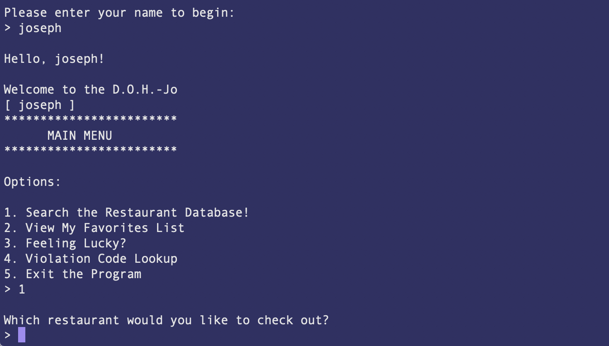

### Instructions

Welcome to the D.O.H.-JO, a straightforward app that makes restaurant inspection results and information easily accessible to the public, and allows users to develop and maintain profiles based on public health information.

The _User Profile_ feature allows a user access to the health inspection data for every restaurant currently operating in New York City. They can search the database to retrieve the restaurant's latest health inspection, its inspection history, and its worst heath code violation.

The _Favorites List_ feature allows a user to maintain a list of their favorite restaurants, ranked by the user's rating. The user's Favorites List may be updated by changing a rating, or by removing a restaurant from the list.

The _Violation Code Lookup_ feature allows the user to view the code and description for every health code violation according to the New York City Department of Health.

The _Feeling Lucky?_ feature delivers a random restaurant inspection
where the score was over 100, and its corresponding code violation
and description.

With Ruby, installation is easy. Simply fork and clone the repository, and run 'ruby bin/run.rb' in your terminal. Make sure to run 'bundle install' beforehand!

---

Code contributions by Adam Sultanov and Henry Koehler.

Health inspection data is free and open to the public via
https://opendata.cityofnewyork.us/
